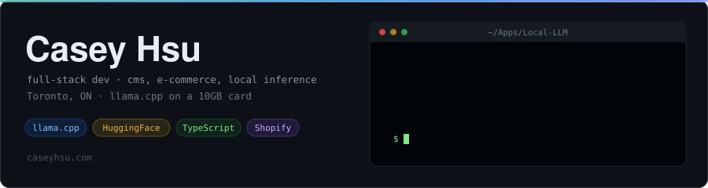
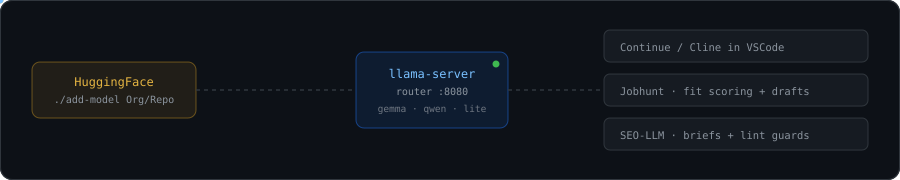

<p align="center">
  <a href="https://caseyhsu.com">caseyhsu.com</a> ·
  <a href="https://linkedin.com/in/casey-hsu">linkedin</a> ·
  <a href="https://caseyhsu.com/resume.pdf">résumé</a> ·
  <a href="mailto:casey-hsu@outlook.com">email</a>
</p>

```console
$ cat ~/.plan
CMS and e-commerce by day: Shopify, HubSpot, WordPress, Contentful.
Local inference by night: llama.cpp, GGUF quants, and an eval suite
that picks which model gets which job so I don't have to guess.
```

I build the client work and the tooling I use to do it. Most spare cycles go into a
three-model local stack on one 10 GB card. No fine-tuning: just prompts, quants, and
measurements.

---

## The lab



`./add-model Org/Repo-GGUF` queries the HuggingFace API, lists every GGUF in the repo with
its quant and size, and writes the download plus a builder preset. `make build` generates
each model's system prompt, `make serve` brings up the router with one slot per model and a
10 minute idle sleep that drops a loaded model from 6226 MiB of VRAM to 242.



Measured by `eval/run-speed.py` on a fixed prompt set, same sampler across all three.
Generation speed is the boring half. Prompt ingest is what you actually feel:

```
prompt tok/s     lite 2796  ·  gemma 701  ·  qwen 430
```

Agentic tools re-read a ~3k token system prompt every turn, so the dense 9B that fits
entirely in VRAM beats both MoE models for tool use despite being the smallest.

```
gemma   gemma4-26b-a4b-it-qat     32K ctx   21 MoE layers on CPU
qwen    qwen3.6-35b-a3b-mtp       32K ctx   34 MoE layers on CPU, MTP
lite    qwen3.5-9b-mtp Q4_K_M     32K ctx   all GPU, speed anchor + 3rd judge
```

Three models rather than two for a measurement reason: the learn and tutor suites grade
with a leave-one-out judge panel, so two models left exactly one judge per response and
inter-judge disagreement could never be computed.

> Moved off Ollama to llama.cpp on 2026-09-14. `gemma` and `qwen` are the same weights,
> copied out of Ollama's blob store, so their benchmark history carries over. `lite` starts
> fresh: Ollama's `qwen3.5:9b` won't load in llama.cpp, so it's unsloth's MTP build now.

## Building

**[Local-LLM](https://github.com/SimBuds/Local-LLM)** · the stack above. Layered Markdown
compiled into system prompts and Modelfiles, plus evals for speed, coding, content, and
tutoring. Every behavior change is version-controlled and reversible.
`llama.cpp` `GGUF` `HuggingFace` `Python`

**[Jobhunt](https://github.com/SimBuds/Jobhunt)** · local-first job-search CLI. Nine ATS
integrations over async HTTP into durable SQLite. Scoring and drafts run on the local
router with schema-constrained JSON and no-fabrication checks. ~700 tests, strict mypy.
`Python` `asyncio` `SQLite` `llama-server`

**[SEO-LLM](https://github.com/SimBuds/SEO-LLM)** · no standalone app. Claude Code is the
runtime, the llama.cpp router is the model server, and lint guards catch banned words,
heading depth, meta length, and JSON-LD before anything ships.
`Claude Code` `llama.cpp` `JSON-LD`

**[Auto-Agent](https://github.com/SimBuds/Auto-Agent)** · FastAPI + Claude API agent.
Postgres memory, Redis context, and a typed capability server bounding what it can do.
Permission-scoped, recorded, survives restarts.
`FastAPI` `Claude API` `Postgres` `Redis`

## Shipped

Three-plus years of client work, usually sole developer and the client's direct contact.

**Atelier Dacko** `2023-now` · WordPress to Shopify migration for a jewelry brand, holding
indexed URLs through full redirect mapping. 16-page storefront on a customized Dawn theme
plus an LLM content pipeline the editorial team reviews.
`-80% drafting time` `+30% organic YoY`

**Neurative AI** `2026` · 8-page HubSpot CMS build from Figma. Reusable HubL modules so
marketing ships without a developer, GitHub Actions CI, clean handoff.
`90+ PageSpeed` `-30% load time`

**Geeked Out Goods** `2024` · Python ingest for a 400+ item Shopify catalog, schema-checking
CSV exports so malformed feeds never reached the live store.
`400+ items` `validated at ingest`

## Stack

```
core      TypeScript · React/Next · Node/Express · Python · PHP/Sass
cms       Shopify (Liquid) · HubSpot (HubL) · WordPress · Contentful · headless
local ai  llama.cpp · GGUF/quants · HuggingFace · MCP · Claude Code · FastAPI
seo       technical SEO · Core Web Vitals · JSON-LD · Search Console · GA4
data      Postgres · MySQL · MongoDB · Redis
devops    Docker · GitHub Actions · Jest · Playwright · AWS · nginx
```

<sub>Contentful Certified Professional · George Brown College, Computer Programming &amp; Analysis (Dean's List) · ten years as a sous chef first, which is where the deadline tolerance comes from.</sub>
